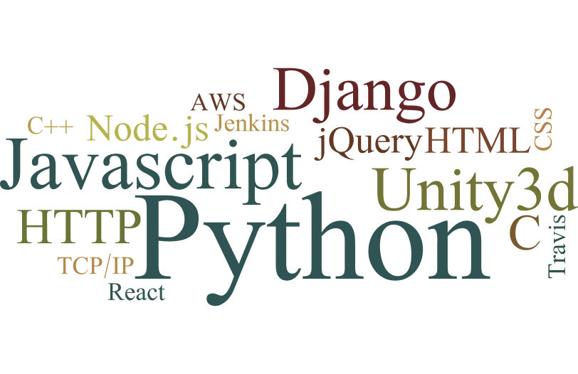

Title: About Me

My name is Tal Einat.

I am:

* Dedicated to improving education and learning
* An R&D leader
* A Python expert and core developer
* A freelance software consultant and developer
* A programmer for over 15 years
* B.Sc. Math & Physics
* Israeli
* Married to Yasmin, father of two

